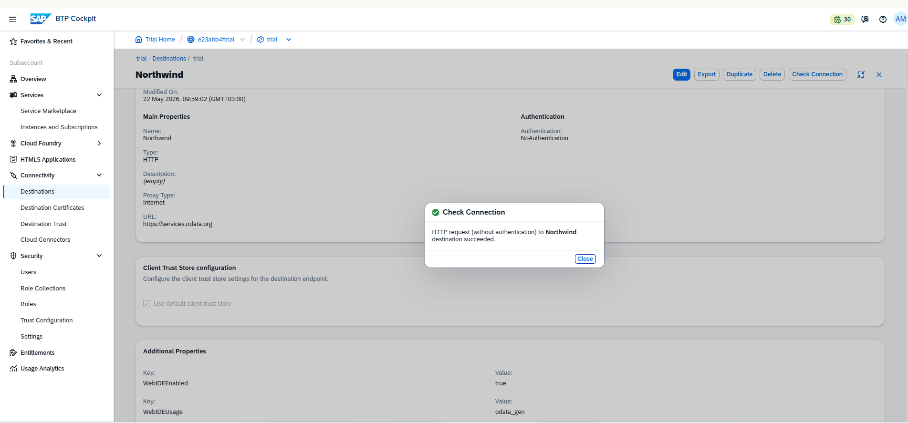
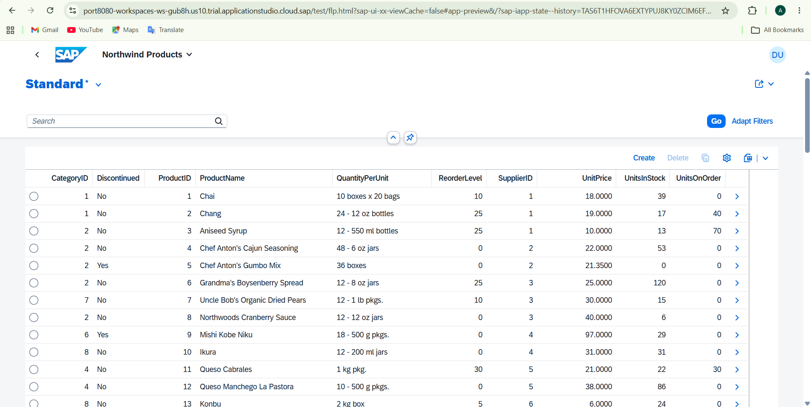
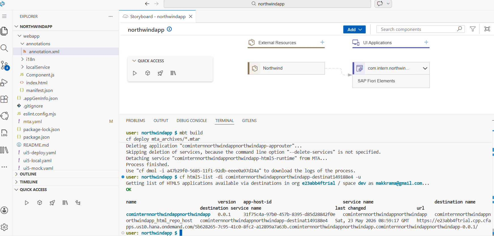

# Northwind Products App

A Fiori List Report app that pulls product data from the Northwind OData service, 
built on SAP BTP as part of the Solex internship assessment.

## Architecture Overview

Three things work together here: a Destination in BTP Cockpit that connects to 
the Northwind service, Business Application Studio where I built and tested the 
app, and Cloud Foundry which handles deployment on BTP.

## Setup Instructions

1. Register for a free SAP BTP Trial at https://account.hanatrial.ondemand.com
2. Subscribe to Business Application Studio and assign yourself the Developer role
3. Create a Destination called `Northwind` pointing to `https://services.odata.org`
4. Set Authentication to NoAuthentication and add these two properties:
   - WebIDEEnabled: true
   - WebIDEUsage: odata_gen
5. Open BAS, create a Fiori dev space and run the Application Generator
6. Connect to `/V2/Northwind/Northwind.svc/` and pick the Products entity

## OData Entity Used

I went with the Products entity — it has fields like ProductName, UnitPrice and 
UnitsInStock which felt like the most realistic thing to display in a list.

## Challenges Faced

The preview kept opening a file browser instead of the actual app. Took me a bit 
to figure out I needed to manually add `/test/flp.html#app-preview` to the URL. 
Also had a Git conflict on the first push which I sorted out by pulling first 
then force pushing. During deployment, the approuter kept crashing due to a 
grant_type mismatch between the html5-apps-repo service plans — resolved by 
switching to a clean html5-repo deployment without a standalone approuter.

## Bonus Tasks Completed

- **B1 — Cloud Foundry Deployment:** Successfully built and deployed the multi-target application (MTA) archive to SAP BTP Cloud Foundry using the HTML5 Repository Service. Built using `mbt build` and deployed via `cf deploy`.

- **B2 — Postman OData Queries:** Tested four query options ($top, $filter, $select, $orderby) against the live Northwind service. Collection exported and included in /docs.

- **B4 — Fiori Object Page:** Added drill-down navigation from the list to a product detail page showing ProductID, ProductName, UnitPrice, UnitsInStock and QuantityPerUnit.

- **B5 — OData POST Request:** Successfully posted a new product to a writable OData mock service and received a 201 Created response. Screenshot included in /docs.

## Deployed Application URL

https://e23abb4ftrial.cpp.cfapps.us10.hana.ondemand.com/5b628265-7c95-41c0-8fc2-a12899a7a63b.cominternnorthwindappnorthwindapp.cominternnorthwindappnorthwindapp-0.0.1/

## Screenshots

